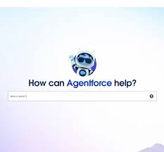

# Salesforce.com Landing Page Clone

A static marketing landing page built with HTML, CSS, and Font Awesome icons. This project demonstrates a polished Salesforce-inspired homepage layout.




## Technologies Used

- HTML
- CSS
- Font Awesome (via CDN)

## Project Structure

```
README.md
|
|-- index.html
|-- css/
|   `-- salesforces.css
|-- img/
|   |-- Salesforce-logo (1).webp
|   |-- slack-flat-icon.svg
|   |-- tableau-icon.webp
|   |-- af-flat-icon.svg
|   |-- 360-flat-icon.svg
|   |-- data-flat-icon.svg
|   |-- home-page assets...
```

## Overview

This project is a simple static website built with HTML and CSS. It includes a responsive navigation header, hero section, feature panels, industry cards, and a modern Salesforce-style visual layout.

## Features

- Fixed top navigation bar with dropdown menu interactions.
- Hero banner with call-to-action buttons.
- Styled content sections for product highlights and case studies.
- Industry solution cards with image icons.
- Mobile-friendly design elements using responsive CSS classes.

## How to Use

1. Open `index.html` in your browser.
2. View the landing page locally.


## Installation

To install this project from GitHub:

1. Open a terminal or command prompt.
2. Clone the repository:

```bash
git clone https://github.com/elijah580/salesforce.com.git
```

3. Change into the project folder:

```bash
cd salesforce.com
```

4. Open `index.html` in your browser or serve the folder with a live server extension.


## Notes

- No build step or JavaScript is required.
- The page uses Font Awesome icons via CDN.
- Update `img/` assets and `css/salesforces.css` styles to customize the design.


## License

MIT

## Contact

- Phone: `08055732902`
- Email: `davidelijah900@gmail.com`

